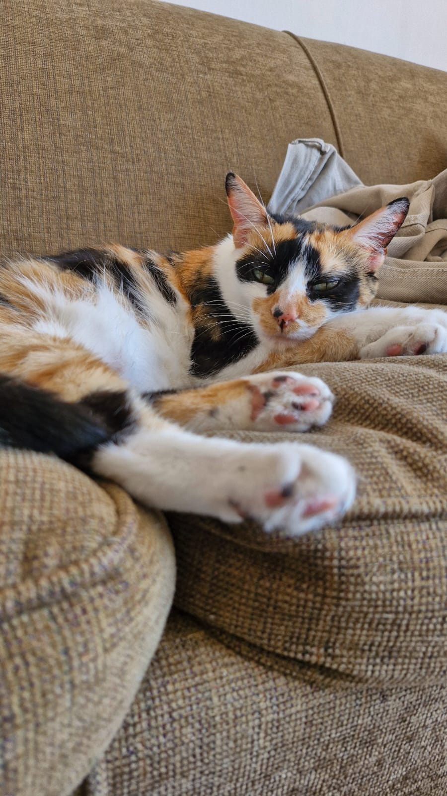
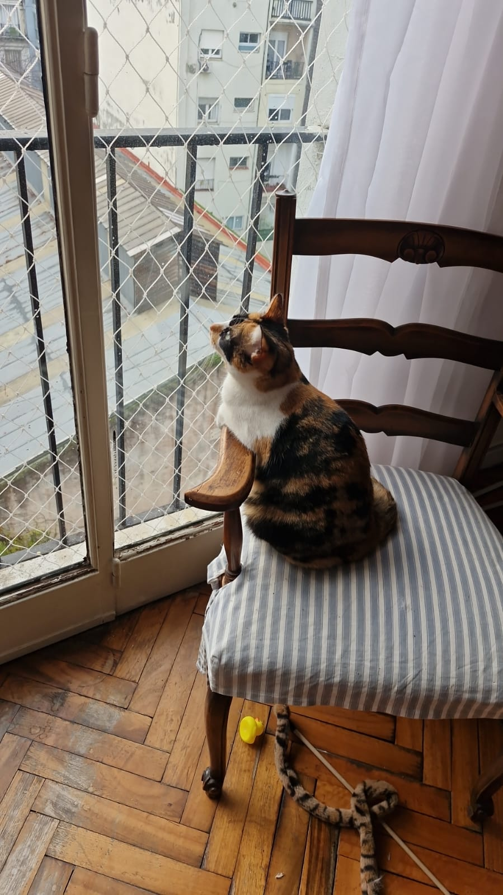

# Presentacion Federico Bremberg

## Información Personal

- **Nombre:** Federico Bremberg
- **Edad:** 26 años
- **Carrera:** Ingeniería en Sistemas en la UTN
- **Trabajo Actual:** Information Security Analyst
- **Legajo:** 163730-7

## Sobre Mí
Me apasiona el fútbol, soy hincha de River Plate y voy a la cancha casi siempre. También disfruto de la música y toco el piano cuando tengo tiempo (y ganas :?). Tengo una gata llamada Tita.

Trabajo como analista de ciberseguridad, área que realmente me apasiona. La vida medio que me llevó por este rumbo, pero creo que fue el camino correcto porque hoy estoy convencido de que fue la mejor decisión profesional que pude tomar. Me motiva seguir aprendiendo y creciendo en este campo.

A pedido del publico hay aca hay un par de fotos de Tita (tengo mas fotos de ella que mias).

